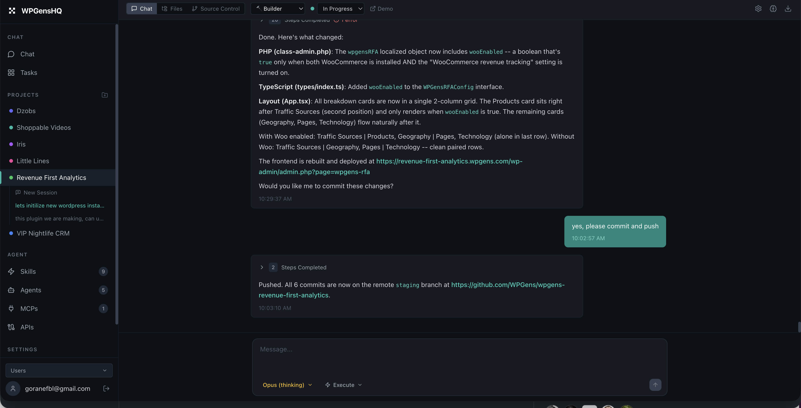
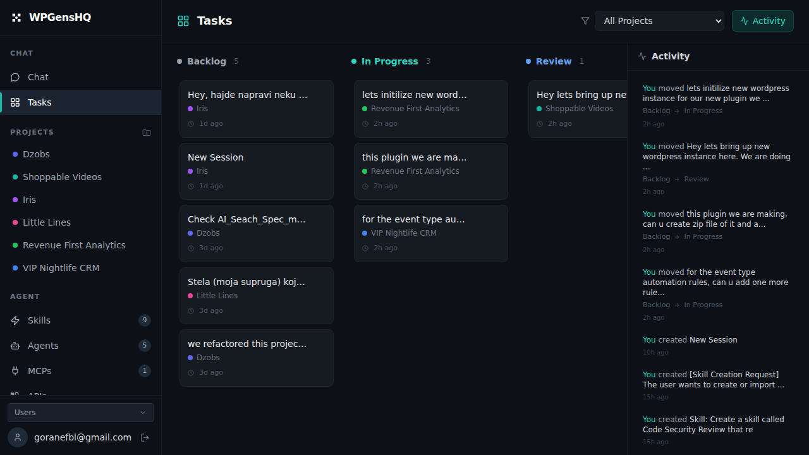
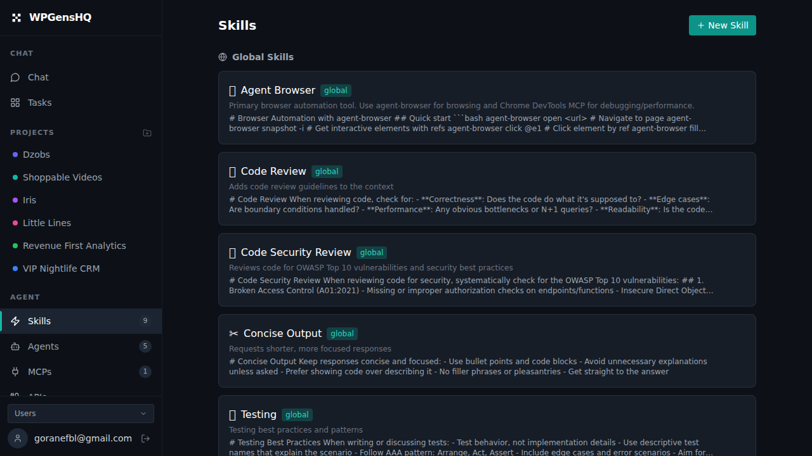
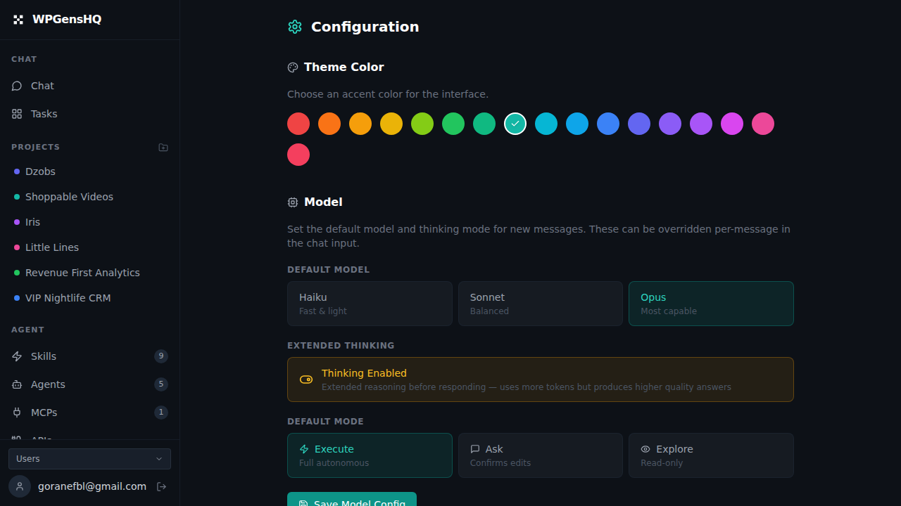

# OptimusHQ

A self-hosted, multi-tenant platform for running multiple Claude Code agents across projects simultaneously. Agents can delegate tasks to each other and communicate across sessions. Manage agents, projects, skills, and sessions from a single dashboard with real-time streaming, browser automation, and a full kanban workflow. Each user gets their own isolated workspace with cloned agents, skills, and settings.

Built with React, Express, WebSocket, and SQLite. Runs on any machine with Node.js and the Claude CLI.









## Why

Claude Code is powerful but limited to one terminal session at a time. This project turns it into a multi-project, multi-agent platform where you can run concurrent agents across different codebases, each with their own context, memory, skills, and tools.

## Features

### Multi-Project Workspace
- Create projects with auto-generated folders at `~/projects/<slug>/` or link existing codebases
- Clone git repositories directly from the UI or via MCP tool
- Each project gets its own dev server port (3100-3999), preview URL, git settings, and server config
- Projects are fully isolated -- agents work within their assigned project directory

### Agents
- 5 built-in agent personas: Builder, Researcher, Debugger, Writer, DevOps
- Create custom agents with tailored system prompts
- Per-agent model selection: Haiku, Sonnet, Opus
- Switch agents mid-session or assign different agents to different tasks
- Each session spawns its own Claude CLI process -- agents work concurrently in the background

### Chat
- Real-time streaming over WebSocket with structured NDJSON output
- Tool use is displayed inline (Bash commands, file edits, browser actions)
- Per-message model override (switch between Haiku/Sonnet/Opus on the fly)
- Message queue with pending message handling across page navigation
- Interrupt running agents at any time
- Session-based isolation with WebSocket message queuing for reliability

### Mission Control (Kanban Board)
- 4-column board: Backlog, In Progress, Review, Done
- Drag-and-drop session cards between columns
- Filter by project with color-coded cards
- Activity feed with timestamped status changes and actor attribution

### Permission Modes
Each session can run in one of three modes:
- **Execute** (default): Full access to all tools -- file writes, bash, browser, everything
- **Explore** (read-only): Can only read files, search, and browse -- all write tools are blocked
- **Ask** (confirmation required): Agent must describe planned changes and wait for user approval before executing

### Skills
- Modular prompt instructions that can be toggled per session
- 3 built-in skills: Code Review, Concise Output, Testing
- Create custom skills with full prompt definitions
- Import skills from [skills.sh](https://skills.sh) or any GitHub URL
- **Chat-based skill creation**: Describe skills in natural language or paste a GitHub repo URL -- the agent imports them conversationally using the `create_skill` MCP tool
- Scope skills globally or per project
- File glob patterns to target specific file types

### APIs
- Register external APIs with base URL, auth config, and endpoint documentation
- Auth types: Bearer token, custom header, query parameter, HTTP Basic
- Generate API configurations from a text description or documentation URL (uses Claude)
- Enable/disable APIs per session -- credentials and docs are injected into the agent's context

### MCP Servers (Model Context Protocol)
Two built-in MCP servers:

**Chrome DevTools** -- Full browser automation:
- Navigate pages, click elements, fill forms, take screenshots
- Read console logs, inspect network requests
- Emulate devices, throttle network, change viewport
- Performance tracing and Core Web Vitals

**Project Manager** -- Project and memory management:
- `create_project` / `clone_project` / `list_projects`
- `get_project_memory` / `update_project_memory`
- `get_server_config` / `update_server_config`
- `create_skill` -- Create skills programmatically from agent conversations
- `create_mcp` -- Create MCP servers programmatically with encrypted env vars
- `delegate_task` / `send_message` -- Cross-session agent delegation
- `add_memory_entry` / `search_memory` / `list_memory_entries` -- Structured memory management
- `get_project_status` -- Check session activity and recent messages

**Internal vs User MCP servers**: System MCP servers (like Project Manager) are hidden from the UI to keep the interface clean. Users can add custom MCP servers with command, args, and environment variables.

**Chat-based MCP import**: Describe an MCP or paste a GitHub/npm URL in the MCPs page -- the agent researches it and creates the MCP configuration using the `create_mcp` tool. Environment variables (API keys) are encrypted at rest using AES-256-CBC.

### Memory
Three levels of persistent memory:

- **Session Memory**: Auto-summarized every 5 messages using Haiku. Keeps conversation context compact without losing important details. Includes pinned facts for critical info that should never be forgotten.
- **Project Memory**: Shared across all sessions in a project. Use it for architecture decisions, known issues, working notes -- anything future sessions should know. Agents can read and write it via MCP.
- **Memory Entries**: Structured, searchable memory items with categories (decision, issue, note, reference, todo), titles, tags, and full-text search. Agents can add entries via `add_memory_entry` and search with `search_memory`.

### Server Config
Dedicated per-project field for dev server management:
- Store startup commands, required services, health check commands, and recovery steps
- Agents automatically check if the dev server is running at session start
- If the server is down, agents follow the stored config to bring it back up
- Agents save server config via MCP after setting up new projects
- Editable in project settings UI

### File Explorer
- Browse project directory tree with smart filtering (ignores node_modules, .git, dist, etc.)
- Read and edit files with syntax-highlighted CodeMirror editor
- Create and delete files and directories
- Path traversal protection -- stays within project boundaries

### Cross-Agent Delegation
- Agents can delegate tasks to other agents via `delegate_task` MCP tool
- Send messages to existing sessions with `send_message`
- Spawns background sessions that work autonomously
- Track delegated work through the activity feed

### Source Control
- Git status, staging, unstaging, commits, diffs -- all from the sidebar
- Branch switching and commit log viewer
- Push/pull with safety controls:
  - Per-project push disable toggle (pull-only mode)
  - Protected branches list (prevent pushes to main, production, etc.)
- Auto-detect git origin URL from existing repos

### Live Preview
- **Subdomain proxy**: `https://<project-name>.<base-domain>/` proxies to the project's dev port
- **Static preview**: `/preview/<project-name>/` serves files directly from the project folder
- Preview URLs are shown in project settings and injected into agent context
- Base domain is configurable in Settings > Platform (admin only)

### Settings
- **Platform** (admin): Base domain for project subdomain URLs (e.g., `example.com` makes projects accessible at `<project>.example.com`)
- Default model selection (Haiku, Sonnet, Opus)
- Default permission mode
- Tool allow/disallow lists (restrict which tools agents can use)
- Theme accent color (12 options)
- GitHub token for authenticated git operations

### Multi-Tenancy
- Multiple users with complete data isolation
- Per-user agents, skills, projects, API keys, MCPs, and settings
- Admin user can switch between users via sidebar dropdown to view their data
- New users get cloned default agents, skills, and their own General project
- WebSocket authentication with user-scoped message delivery
- bcrypt password hashing with database-persisted auth tokens
- All 13 API routes scoped by user_id with cross-user access blocked

### Project Isolation (Security)
- Agents are restricted to their assigned project directory via Claude Code hooks
- File operations (Read, Write, Edit) are validated against the project path
- Prevents cross-project file access even with `--dangerously-skip-permissions`
- /tmp is allowed for temporary files
- General project (no path) has unrestricted access
- Hook is auto-configured on server startup

### WhatsApp Integration
- Chat with agents via WhatsApp on your phone
- Admin connects WhatsApp via QR code in Settings
- Users are identified by phone number (must be set in profile)
- Messages routed to user's account based on registered phone
- Uses Baileys (lightweight WebSocket client) -- no Puppeteer or browser needed

### Mobile Responsive
- Collapsible sidebar with hamburger menu on mobile
- Responsive layouts across all pages
- Touch-friendly UI elements
- Works on phones and tablets

### Blog
- Built-in blog system with markdown support
- Migrated from Sanity CMS
- SEO-friendly URLs

### Database Backups
- Daily automated SQLite backups
- 7-day retention policy
- Backup script included (`backup-db.sh`)

## Architecture

```
optimushq/
├── client/             # React 18 + Vite + Tailwind CSS
│   ├── src/pages/      # 10 pages (Chat, Board, Agents, Skills, APIs, MCPs, Settings, etc.)
│   ├── src/components/ # Organized by feature
│   └── src/hooks/      # 13 custom React hooks
├── server/             # Express + WebSocket + SQLite
│   ├── src/routes/     # REST API (projects, sessions, skills, APIs, git, files, etc.)
│   ├── src/claude/     # CLI spawning and context assembly
│   ├── src/tools/      # MCP server implementations
│   └── src/ws/         # WebSocket message handling
├── shared/             # TypeScript interfaces shared between client and server
├── mcp-config.json     # Generated MCP configuration (dynamic)
├── ecosystem.config.cjs # PM2 config
└── start-chrome.sh     # Headless Chrome launcher
```

**How a message flows:**

1. User sends message in chat UI
2. Server saves message to SQLite, assembles full context (agent prompt + project info + skills + APIs + memory + server config + permission rules)
3. Spawns `claude` CLI with `--output-format stream-json` and `--mcp-config`
4. Streams NDJSON response chunks back over WebSocket in real-time
5. Tool use (file edits, bash commands, browser actions) displayed inline
6. Response saved to DB, auto-summarization triggers every 5 messages

## Prerequisites

- Node.js 20+
- [Claude CLI](https://docs.anthropic.com/en/docs/claude-cli) installed and authenticated (`claude --version` should work)
- Chrome/Chromium (optional, for browser automation via DevTools MCP)

## Quick Start

### Option 1: npx (fastest)

```bash
npx @goranefbl/optimushq
```

Opens at `http://localhost:3001`. Login with `admin` / `admin`.

**Important: Do not run as root.** Claude CLI blocks `--dangerously-skip-permissions` for root users. Create a non-root user:

```bash
sudo useradd -m claude
sudo su - claude
npx @goranefbl/optimushq
```

To enable WhatsApp, go to Settings and scan the QR code with WhatsApp.

### Option 2: Clone and run

```bash
git clone https://github.com/goranefbl/optimushq.git
cd optimushq

npm install
npm run dev
```

Opens at `http://localhost:5173` (Vite proxies API calls to port 3001).

**Default login**: Set via `AUTH_USER` and `AUTH_PASS` environment variables (defaults to `admin` / `admin`)

## Production

```bash
npm run build

# Option 1: Run directly
AUTH_USER=admin AUTH_PASS=changeme PORT=3001 npx tsx server/src/index.ts

# Option 2: PM2 (recommended)
pm2 start ecosystem.config.cjs
```

The app runs at `http://localhost:3001` with the built frontend served statically.

## Environment Variables

| Variable | Description | Default |
|----------|-------------|---------|
| `PORT` | Server port | `3001` |
| `AUTH_USER` | Login username | `admin` |
| `AUTH_PASS` | Login password | `admin` |
| `BASE_DOMAIN` | Fallback domain for project subdomains (can also be set in Settings) | `localhost` |

## Default Seed Data

On first run the server creates:

- **5 agents**: Builder (default), Researcher, Debugger, Writer, DevOps
- **5 skills**: Code Review, Concise Output, Testing, WordPress Plugin Dev, Email Marketing
- **2 MCP servers**: Chrome DevTools (user-visible), Project Manager (internal)
- **1 project**: General (for unscoped chats)

## Database

SQLite with WAL mode. 19 tables covering users, auth tokens, projects, agents, sessions, messages, skills, APIs, MCP servers, memory entries (with FTS5 full-text search), activity log, blog posts, and settings. Schema is auto-created on first run with automatic migrations for new columns.

### Automated Backups

A backup script is included at `scripts/backup-db.sh` that:
- Creates safe backups using SQLite's backup API (works while server is running)
- Compresses backups with gzip
- Retains 7 days of backups automatically

To enable daily backups, add to crontab (`crontab -e`):
```bash
0 3 * * * /path/to/optimushq/scripts/backup-db.sh >> /home/claude/backups/backup.log 2>&1
```

Backups are stored in `/home/claude/backups/` (outside the repo for security).

## Optional: HTTPS with Cloudflare Tunnel

```bash
cloudflared tunnel --url http://localhost:3001
```

## Optional: Subdomain Proxy with Cloudflare

To enable project subdomains (e.g., `myproject.yourdomain.com`), set up Cloudflare DNS:

1. **Add a wildcard DNS record** in Cloudflare:
   - Type: `A`
   - Name: `*`
   - Content: `<your-server-ip>`
   - Proxy status: Proxied (orange cloud)

2. **Add the root domain** (if not already):
   - Type: `A`
   - Name: `@`
   - Content: `<your-server-ip>`
   - Proxy status: Proxied

3. **Set the base domain** in OptimusHQ:
   - Go to Settings > Platform
   - Enter your domain (e.g., `yourdomain.com`)
   - Save

4. **SSL/TLS settings** in Cloudflare:
   - Go to SSL/TLS > Overview
   - Set encryption mode to "Full" or "Full (strict)"

Projects will now be accessible at `https://<project-name>.yourdomain.com/`, automatically proxied to each project's dev port.

## Optional: Chrome for DevTools MCP

```bash
./start-chrome.sh
```

Launches headless Chrome with remote debugging on port 9222. Enables browser automation tools for all agents.

## Contributing

Contributions welcome. The codebase is TypeScript end-to-end with shared types between client and server. Key areas:

- `server/src/claude/context.ts` -- How agent context is assembled
- `server/src/tools/project-manager-mcp.ts` -- MCP tool implementations
- `client/src/pages/` -- UI pages
- `server/src/routes/` -- API endpoints

## License

MIT
